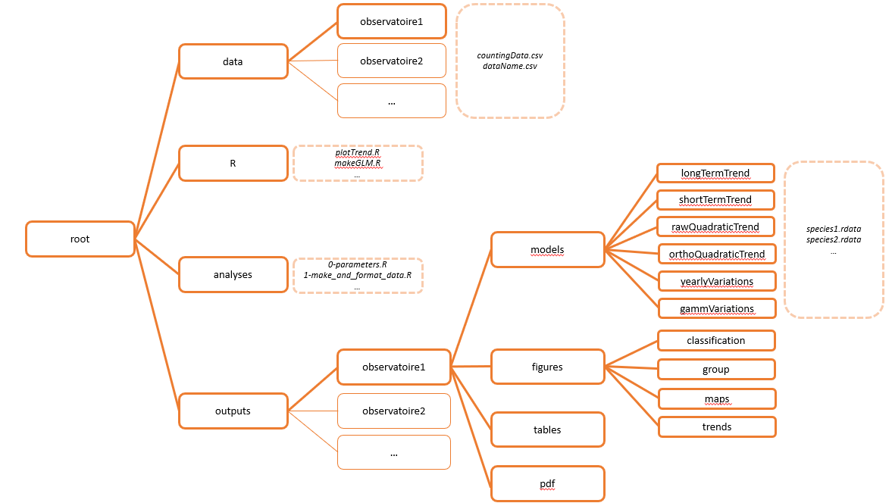

```{r, include = FALSE}
knitr::opts_chunk$set(
  collapse = TRUE,
  comment = "#>",
  echo = FALSE
)
```

```{r setup, include=FALSE}
devtools::load_all(here::here())
library(dplyr)
library(kableExtra)
```

## Introduction

Cette routine d’analyses a pour but de calculer les indicateurs de tendances à partir des données d’observations d’espèces issues de différents observatoires de Vigie-Nature. Ce document doit permettre de bien comprendre le fonctionnement du projet R associé, et de prendre en main facilement les différents scripts. Une première partie décrit les pré-requis au bon déroulement de l’analyse, notamment en termes d’installation de l’environnement, de données à fournir et de paramètres à choisir.

## Pré-requis

### Lancement du projet

Pour utiliser correctement la routine, il faut avant toute chose ouvrir le projet *indicatorRoutine.Rproj* dans RStudio. 

### Arborescence



### Traitement des fichiers tex

La routine crée un certain nombre de fichiers sous format pdf. La production de ces fichiers par R requiert l'installation préalable d'un logiciel de traitement des fichiers tex. Vous pouvez télécharger ici un de ces logiciel. Lors de l'installation, une fenêtre « Windows a protégé votre ordinateur » peut apparaître auquel cas : cliquer sur « Informations complémentaires » et « Exécuter quand même ».

*NB : pour que tout fonctionne bien, l'option « Install packages automatically (on-the-fly) » doit être cochée à Yes (lors de l'installation) ou Always (dans les settings, après installation).*

![Figure 2 : Options à cocher dans les paramètres du logiciel MiKTex]

### Packages et versions

L'ensemble des packages utilisés sont regroupés dans le Tableau 1. Tous les packages sont automatiquement chargés/installés au lancement de la routine : si ce n'est pas le cas, R vous demandera s'il faut les installer, charger ou mettre à jour, et il faudra répondre oui (Yes ou 1). 
La version de R utilisée en local pour développer cette routine est : R 4.3.1.

```{r}
tab <- knitr::kable(
  data.frame(
    utilisation = c(
      rep("Mise en place de l'environnement", 2),
      rep("Nettoyage de données et visualisation", 4), 
      rep("Modèles", 2),
      "Cartographie",
      rep("Formattage rmarkdown", 2)
    ),
    packages = c(
      "devtools", "here",
      "stringr", "tidyverse", "cowplot", "maps",
      "glmmTMB", "mgcv",
      "sf",
      "kableExtra", "rmarkdown"
    ),
    versions = c(
      "2.4.5", "1.0.1",
      "1.5.0", "2.0.0", "1.1.1", "3.4.1",
      "1.1.7", "1.8-42",
      "1.0-13",
      "1.3.4",
      "2.22"
    )
  ),
  col.names = c("Utilisation", "Packages", "Versions"),
  caption = "Tab. 1 : Packages et versions utilisées",
  align = "lc",
  format = "html"
)

collapse_rows(tab, columns = c("Utilisation"))
```

### Données

#### Formattage des observations

Les données d'observation doivent être déposées dans le répertoire **data**, au sein d'un sous-répertoire dont le nom est à choisir par l'utilisateur (**observatoire1** sur la Figure 1). Ces données d'observations doivent être au format .csv et porter le nom *countingData.csv*. Elles doivent obligatoirement contenir :

 - Une colonne `species` contenant le nom unique des espèces idéalement sous un format simple sans caractère spécial (ex : TURMER, PARMAJ, …) ;
 - Une colonne `site` contenant le nom des lieux d'observation. Si le jeu de données contient deux niveaux spatiaux d'observation (e.g, placette et maille, ou point et site) alors une colonne supplémentaire `point` doit être utilisée pour décrire un niveau spatial plus fin ;
 - Une colonne `year` contenant l'année d'observation. Si le jeu de données contient plusieurs niveaux temporels d'observation (i.e, plusieurs passages dans la même année) alors une colonne supplémentaire `session` doit être renseignée pour identifier chaque passage ;
 - L'utilisateur peut également renseigner les coordonnées spatiales des sites (ou points) au format décimal, sous le nom de `longitude` et `latitude`, cela permet notamment la création de cartes d'occurrence ;
  
L'utilisateur peut également renseigner d'autres variables au nom libre, s'il souhaiter les utiliser comme covariables dans les modèles.

#### Format de la variable réponse

La routine peut prendre en charge les données d'abondance et d'occurrence. Les données d'occurrence doivent être formattées de telle sorte à avoir deux colonnes, une contenant le nombre de fois où l'espèce a été vue, et l'autre contenant le nombre de fois où l'espèce n'a pas été vue. Le nom de ces colonnes n'est pas imposé.

```{r}
knitr::kable(
  data.frame(
    info = c("Description de la colonne", rep("Exemple de remplissage", 4)),
    success = c(
      "Nombre de placettes où l'espèce a été vue",
      "9", "5", "2", "..."
    ),
    fail = c(
      "Nombre de placettes où l'espèce n'a pas été vue",
      "1", "5", "8", "..."
    )
  ),
  align = "lcc",
  colnames = c("Exemple de nom de colonne", "nbSuccess", "nbFail"),
  caption = "Tab 2 : Format de données d'occurence"
)
```

La ligne de code R pour renommer les colonnes est la suivante (les noms sont à adapter en fonction de l'ordre des colonnes, et des variables présentes dans le jeu de données):

```{r echo =TRUE, eval = FALSE}
colnames(data) <- c("species", "site", "point", "year", "longitude", "latitude", "nbSuccess", "nbFail")
```

#### Fichier optionnel : nom des espèces

Un fichier optionnel *speciesName.csv* peut être déposé dans le répertoire **data / observatoire1 /**. Ce fichier contient les correspondances entre nom de code, nom français et nom scientifique. Le format doit être le suivant :

```{r}
knitr::kable(
  data.frame(
    sp = c("COLPAL", "OENOEN"),
    french = c("Pigeon ramier", "Traquet motteux"),
    sci = c("Columba palumbus", "Oenanthe oenanthe")
  ),
  align = "ccc",
  colnames = c("species", "french_name", "scientific_name"),
  caption = "Tab 3 : Format du jeu de données de noms speciesNames.csv"
)
```

### Paramètres 

L'utilisateur peut choisir un certain nombre de paramètres afin d'adapter la routine de calcul d'indicateurs à ses données et à ses besoins. Les paramètres se trouvent dans le dossier analyses, à l'intérieur du fichier 0-parameters.R. Ces paramètres sont à modifier avant de lancer la routine de calculs. 

Paramètres de contexte :

 - `repo` : nom du sous-dossier où sont contenues les données
 - `obs` : nom de l’observatoire étudié
 - `spatialScale` : nom de l’échelle d’étude (e.g, nationale, Île-de-France, …)
 
Paramètres de fonctionnalités :

 - `makeShortTrend` : TRUE si la tendance court-terme doit être réalisée
 - `makeGammTrend` : TRUE si le GAMM doit être réalisé
 - `makeQuadraticTrend` : TRUE si la tendance quadratique doit être réalisée
 - `makeGroupPlot` : TRUE si les figures par groupes d’espèces doivent être réalisées
 - `makePDF` : TRUE si le pdf doit être généré.
 
Paramètres de filtre des données` :

 - `speciesList` : liste d’espèces à analyser
 - `yearRange` : valeurs minimales et maximales de la série temporelle à analyser.
 
 Paramètres de spécifications des modèles :

 - `distribution` : loi de distribution.  A choisir entre gaussian, poisson, nbinom2, binomial, betabinomial. *NB: la routine prévoit d’assigner une loi si non renseignée*
 - `interestVar` : variable à expliquer *NB: si données d’occurrence, les deux variables (vu / non vu) doivent être spécifiées*
 - `fixedEffects` : variables explicatives continues traitées comme effet fixe
 - `factorVariables` : variables explicatives catégorielles traitées comme effet fixe
 - `poly` : variables explicatives continues à traiter comme polynômes du deuxième degré. Un effet spécifié dans `poly` ne doit pas l’être dans `fixedEffects`
 - `randomEffects` : variables explicatives traitées comme effet aléatoire
 - `nestedEffects` : variables explicatives traitées comme effet aléatoires emboîtés, avec l’effet le plus précis en premier et celui englobant ensuite (e.g, `c("point", "site")`)
 - `slopeRandomEffects` : variables explicatives traitées comme une pente en effet aléatoire, avec la pente en premier, et la variable structurante ensuite (e.g, `c("year", "site")`)
 - `contr`: niveau de référence pour le traitement catégoriel de la variable année. Pour la fixer à la moyenne des années, renseigner `"mean"`.
 
Paramètres pour les groupes :

 - `groupNames` : nom des groupes
 - `groupComp` : espèces incluses dans chaque groupe
 - `groupCols` : couleurs à utiliser pour chaque groupe
 
 
### Lancement de la routine
 
La routine peut être lancée à partir du fichier make.R, qui se trouve à la racine du dossier. Ce fichier permet d’appeler les scripts d’analyse les uns après les autres. Chaque utilisation de la routine nécessite a minima de lancer les lignes suivantes, qui permettent l’installation de l’environnement selon le système d'exploitation, et le chargement des paramètres et données :

```{r eval =FALSE, echo = TRUE}
if (.Platform$OS.type == "unix") {
  if(system.file(package='renv') == ""){
    install.packages("renv", repos = "https://pbil.univ-lyon1.fr/CRAN/")
  }
  
  ## DEPENDENCIES (see DESCRIPTION) ##
  renv::restore(prompt = FALSE)
} else {
  if (system.file(package = 'devtools') == "") {
    install.packages("devtools", repos = "https://pbil.univ-lyon1.fr/CRAN/")
  }
  
  devtools::install_deps(upgrade = "always")
}

## PACKAGES AND FUNCTIONS ## 
devtools::load_all(here::here())
`%>%` = magrittr::`%>%`

## RUN PROJECT ##
# Load parameters
source(here::here("analyses", "0-parameters.R"))#default parameters

# Replace with customized parameters if exist
if (file.exists(here::here("analyses", "0b-load-parameters.R"))) {
  source(here::here("analyses", "0b-load-parameters.R"))
}

# Import and format data
source(here::here("analyses", "1-import_and_clean_data.R"))
```


## Déroulé

### 1. Formattage des données

L’importation et la mise en forme des données est réalisée dans le fichier d’analyses 1-import_and_clean_data. Cette étape de mise en forme passe notamment par :

 - La vérification que les variables obligatoires (`year`, `species`, `site`), et celles renseignées comme variables réponses ou explicatives dans les paramètres, sont bien contenues dans le jeu de données. Si ce n’est pas le cas, une erreur apparaîtra. *Remarque : le jeu de données résultant est filtré pour ne contenir que ces variables*
 - L’ajout d’une variable `ID`, correspondant à un identifiant unique de l’observation
 - Le remplissage des 0 dans le jeu de données pour tout endroit visité où l’espèce a déjà été vue  au moins une fois
 - Le filtre des données pour la profondeur temporelle souhaitée (`yearRange`)
 - Le filtre des données pour les espèces d’intérêt (`speciesList`). Si pas d’espèces renseignées, alors la liste `speciesList` est automatiquement créée pour ne contenir que les espèces contenant au total au moins 5 x nombre d’années d’observation de présence.

*NB : le warning suivant peut apparaître au lancement de ce script, et ne doit pas inquiéter l’utilisateur :*

```
Warning message:
In data.table::fread(file = dataPath, encoding = "UTF-8", drop = "V1") :
  Column name 'V1' (drop[1]) not found
```

### 2. Estimations des tendances

#### Tendances

L’estimation des tendances est réalisée dans le script *2-estimate-trends*. Pour chaque espèce, la tendance long-terme sur l’ensemble de la série temporelle est réalisée, ainsi que les variations annuelles. Pour les variations annuelles, toute pente aléatoire sur l’année est retirée des analyses puisque la variable `year` est traitée comme une variable catégorielle. La tendance court-terme est réalisée si le paramètre `makeShortTerm` est `TRUE`. Elle est réalisée seulement sur les 10 dernières années. Les tendances quadratiques sont réalisées si le paramètre `makeQuadraticTrend` est `TRUE`. Dans ce cas, l’année `year` est traitée comme une variable polynomiale du second degré (deux modalités possibles : soit le polynôme est brut, soit il est orthogonal). 

En cas de non-convergence d’un de ces modèles, la routine prévoit quatre cas de figures :
 
 1. Il n’y a pas de dispersion (paramètre de dispersion extrême : $\phi > 10^4$) alors qu’une loi de distribution négative binomiale ou bétabinomiale a été renseignée : le modèle est relancé avec une distribution sans dispersion (i.e, poisson ou binomiale)
 2. Une variable aléatoire présente une variance très faible ($\sigma^2 < 10^{-4}$): le modèle est relancé sans cette variable aléatoire. 
*NB : s’il s’agit d’une variable englobante d’un effet emboîté, le modèle est relancé sans effet emboîté, mais avec une variable aléatoire d’interaction simple. S’il s’agit d’une variable englobée d’un effet emboîté, le modèle est relancé sans cet effet emboîté mais avec l’effet englobant comme variable aléatoire simple.*
 3. Un des VIFs présente une valeur trop élevée (VIF > 5) : alors cette variable est retirée du modèle.
*NB : si cette variable est l’année `year`, alors elle ne peut pas être retirée. Les variables polynomiales ne sont pas concernées par cette étape.*
 4. Si malgré ces vérifications, le modèle n’a toujours pas convergé, un deuxième modèle est réalisé en repartant des paramètres estimés dans le modèle non-convergent. Si les estimations de l’année (estimate et erreur standard) de ce deuxième modèle sont suffisamment proches ($10^{-3}$) de ceux du modèle non-convergent, alors on considère qu’on a atteint la convergence.
 
Le GAMM est réalisé si le paramètre `makeGammTrend` est `TRUE`. NB : la loi « bétabinomiale » n’existe pas dans le package mgcv, et on utilise donc ici la « quasibinomiale » en cas de dispersion. Enfin, si le GAMM ne converge pas, aucun autre essai n’est réalisé. 
