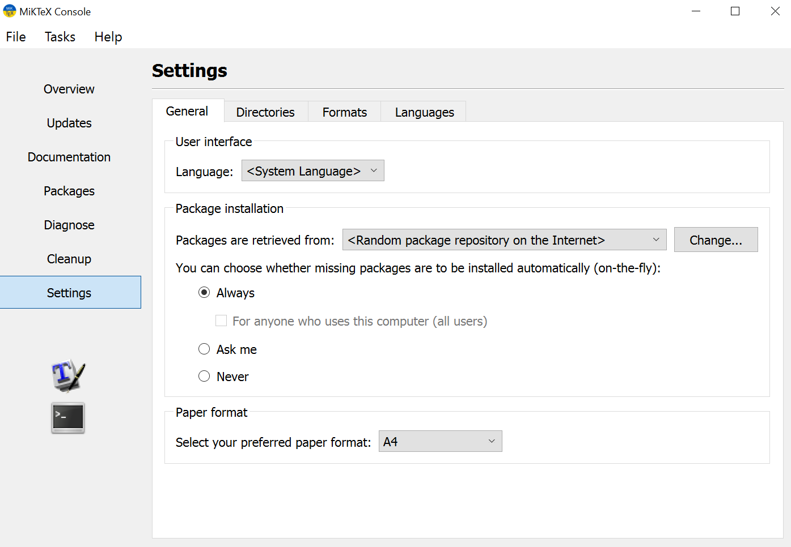
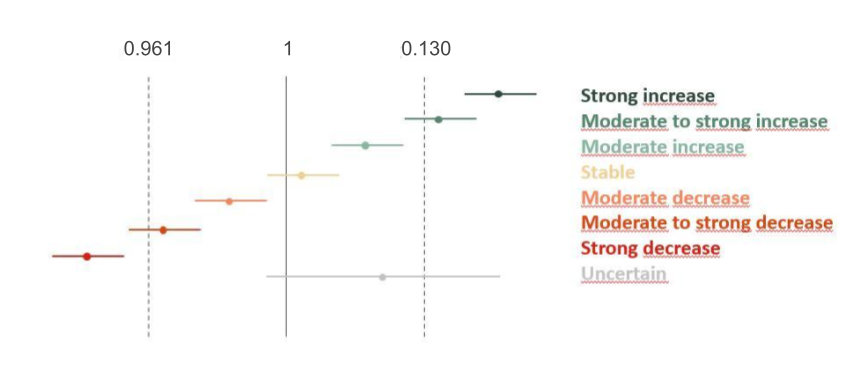
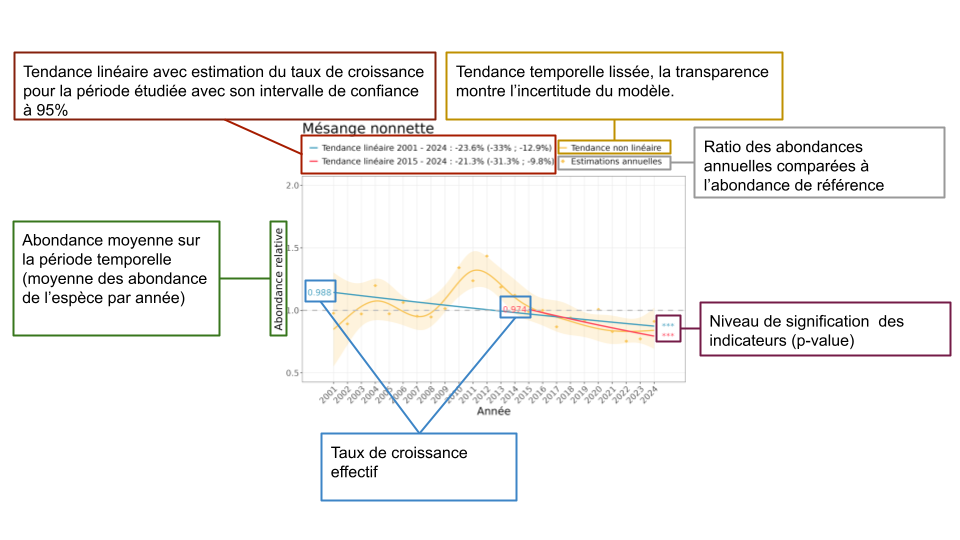

```{r, include = FALSE}
knitr::opts_chunk$set(
  collapse = TRUE,
  comment = "#>",
  echo = FALSE
)
```

```{r setup, include=FALSE}
devtools::load_all(here::here())
library(dplyr)
library(kableExtra)
```

## Introduction

Cette routine d’analyses a pour but de calculer les indicateurs de tendances à partir des données d’observations d’espèces issues de différents observatoires de Vigie-Nature. Ce document doit permettre de bien comprendre le fonctionnement du projet R associé, et de prendre en main facilement les différents scripts. Une première partie décrit les pré-requis au bon déroulement de l’analyse, notamment en termes d’installation de l’environnement, de données à fournir et de paramètres à choisir.

## Pré-requis

### Lancement du projet

Pour utiliser correctement la routine, il faut avant toute chose ouvrir le projet *indicatorRoutine.Rproj* dans RStudio. 

### Arborescence


### Traitement des fichiers tex

La routine crée un certain nombre de fichiers sous format pdf. La production de ces fichiers par R requiert l'installation préalable d'un logiciel de traitement des fichiers tex. Vous pouvez télécharger ici un de ces logiciel. Lors de l'installation, une fenêtre « Windows a protégé votre ordinateur » peut apparaître auquel cas : cliquer sur « Informations complémentaires » et « Exécuter quand même ».

*NB : pour que tout fonctionne bien, l'option « Install packages automatically (on-the-fly) » doit être cochée à Yes (lors de l'installation) ou Always (dans les settings, après installation).*



### Packages et versions

L'ensemble des packages utilisés sont regroupés dans le Tableau 1. Tous les packages (aux versions affichées ou plus récentes) sont automatiquement chargés/installés au lancement de la routine : si ce n'est pas le cas, R vous demandera s'il faut les installer, charger ou mettre à jour, et il faudra répondre oui (Yes ou 1). 
La version de R utilisée en local pour développer cette routine est : R 4.3.1.

```{r}
table_packages <- knitr::kable(
  data.frame(
    utilisation = c(
      rep("Mise en place de l'environnement", 2),
      rep("Nettoyage de données et visualisation", 4), 
      rep("Modèles", 2),
      "Cartographie",
      rep("Formattage rmarkdown", 2)
    ),
    packages = c(
      "devtools", "here",
      "stringr", "tidyverse", "cowplot", "maps",
      "glmmTMB", "mgcv",
      "sf",
      "kableExtra", "rmarkdown"
    ),
    versions = c(
      "2.4.5", "1.0.1",
      "1.5.0", "2.0.0", "1.1.1", "3.4.1",
      "1.1.7", "1.8-42",
      "1.0-13",
      "1.3.4",
      "2.22"
    )
  ),
  col.names = c("Utilisation", "Packages", "Versions"),
  caption = "Tab. 1 : Packages et versions utilisées",
  align = "lc",
  format = "html"
)

kableExtra::collapse_rows(table_packages, columns = c(1))
```

#### renv
Un fichier renv.lock se trouve à la racine du projet. Il contient des informations précises sur les dépendances et versions de packages de la routine et permet de restaurer entièrement l'environnement. Ce fichier peut-être mis à jour par les gestionnaires de la routine pour des versions plus récentes de R et de packages associés et permettre aux utilisateurs de suivre ces évolutions simplement avec la commande 
```{r echo =TRUE, eval = FALSE}
renv::restore()
```
Pour l'instant, la routine est configurée pour restaurer l'environnement avec renv uniquement pour les utilisateurs sous linux, autrement, ce sont les packages et versions indiqués dans le fichier DESCRIPTION qui seront automatiquement chargés.


### Données

#### Formattage des observations

Les données d'observation doivent être déposées dans le répertoire **data**, au sein d'un sous-répertoire dont le nom est à choisir par l'utilisateur (**observatoire1** sur la Figure 1). Ces données d'observations doivent être au format .csv et le nom du fichier est renseigné dans l'objet `Data`. Elles doivent obligatoirement contenir :

 - Une colonne `species` contenant le nom unique des espèces idéalement sous un format simple sans caractère spécial (ex : TURMER, PARMAJ, …) ;
 - Une colonne `site` contenant le nom des lieux d'observation. Si le jeu de données contient deux niveaux spatiaux d'observation (e.g, placette et maille, ou point et site) alors une colonne supplémentaire `point` doit être utilisée pour décrire un niveau spatial plus fin ;
 - Une colonne `year` contenant l'année d'observation. Si le jeu de données contient plusieurs niveaux temporels d'observation (i.e, plusieurs passages dans la même année) alors une colonne supplémentaire `session` doit être renseignée pour identifier chaque passage ;
 - L'utilisateur peut également renseigner les coordonnées spatiales des sites (ou points) au format décimal, sous le nom de `longitude` et `latitude`, cela permet notamment la création de cartes d'occurrence ;
  
L'utilisateur peut également renseigner d'autres variables au nom libre, s'il souhaiter les utiliser comme covariables dans les modèles.

Pour le SHOC, ou autre suivi hivernal dont les données sont récoltées à cheval sur deux années (passages en décembre et janvier), il est possible de renseigner une variable `saison` contenant les années concernées pour cette saison hivernale (e.g. "2020-2021"). Les tendances seront calculées en considérant la première année renseignée comme référence mais les plots en sortie seront ajustés pour que l'abscisse indique la saison en question. 

#### Format de la variable réponse

La routine peut prendre en charge les données d'abondance et d'occurrence. Les données d'occurrence doivent être formattées de telle sorte à avoir deux colonnes, une contenant le nombre de fois où l'espèce a été vue, et l'autre contenant le nombre de fois où l'espèce n'a pas été vue. Le nom de ces colonnes n'est pas imposé.

```{r}
table_occurrence <- knitr::kable(
  data.frame(
    info = c("Description de la colonne", rep("Exemple de remplissage", 4)),
    success = c(
      "Nombre de placettes où l'espèce a été vue",
      "9", "5", "2", "..."
    ),
    fail = c(
      "Nombre de placettes où l'espèce n'a pas été vue",
      "1", "5", "8", "..."
    )
  ),
  align = "lcc",
  col.names = c("Exemple de nom de colonne", "nbSuccess", "nbFail"),
  caption = "Tab 2 : Format de données d'occurence"
)

collapse_rows(table_occurrence, columns = c(1))
```

La ligne de code R pour renommer les colonnes est la suivante (les noms sont à adapter en fonction de l'ordre des colonnes, et des variables présentes dans le jeu de données):

```{r echo =TRUE, eval = FALSE}
colnames(data) <- c("species", "site", "point", "year", "longitude", "latitude", "nbSuccess", "nbFail")
```

#### Fichier optionnel : nom des espèces

Un fichier optionnel *speciesName.csv* peut être déposé dans le répertoire **data / observatoire1 /**. Ce fichier contient les correspondances entre nom de code, nom français, nom scientifique et le nom français "simplifié" (i.e. sans accents ni espaces). Le format doit être le suivant :

```{r}
knitr::kable(
  data.frame(
    sp = c("COLPAL", "OENOEN","DELURB"),
    french = c("Pigeon ramier", "Traquet motteux", "Hirondelle de fenêtre"),
    sci = c("Columba palumbus", "Oenanthe oenanthe", "Delichon urbicum"),
    french_spl = c("Pigeon_ramier", "Traquet_motteux","Hirondelle_de_fenetre")
  ),
  align = "ccc",
  col.names = c("species", "french_name", "scientific_name","french_name_simplified"),
  caption = "Tab 3 : Format du jeu de données de noms speciesNames.csv"
)
```

### Paramètres 

L'utilisateur peut choisir un certain nombre de paramètres afin d'adapter la routine de calcul d'indicateurs à ses données et à ses besoins. Les paramètres se trouvent dans le dossier analyses, à l'intérieur du fichier 0-parameters.R. Ces paramètres sont à modifier avant de lancer la routine de calculs. 

Paramètres de contexte :

 - `repo` : nom du sous-dossier où sont contenues les données
 - `Data` : nom du jeu de données .csv (e.g. countingData.csv)
 - `obs` : nom de l’observatoire étudié
 - `spatialScale` : nom de l’échelle d’étude (e.g, nationale, Île-de-France, …)
 
Paramètres de fonctionnalités :

 - `makeShortTrend` : TRUE si la tendance court-terme doit être réalisée
 - `makeGammTrend` : TRUE si le GAMM doit être réalisé
 - `makeQuadraticTrend` : TRUE si la tendance quadratique doit être réalisée
 - `makeGroupPlot` : TRUE si les figures par groupes d’espèces doivent être réalisées
 - `makePDF` : TRUE si le pdf doit être généré.
 
Paramètres de filtre des données` :

 - `speciesList` : liste d’espèces à analyser
 - `yearRange` : valeurs minimales et maximales de la série temporelle à analyser.
 
 Paramètres de spécifications des modèles :

 - `distribution` : loi de distribution.  A choisir entre gaussian, poisson, nbinom2, binomial, betabinomial. *NB: la routine prévoit d’assigner une loi si non renseignée*
 - `interestVar` : variable à expliquer *NB: si données d’occurrence, les deux variables (vu / non vu) doivent être spécifiées*
 - `fixedEffects` : variables explicatives continues traitées comme effet fixe
 - `factorVariables` : variables explicatives catégorielles traitées comme effet fixe
 - `poly` : variables explicatives continues à traiter comme polynômes du deuxième degré. Un effet spécifié dans `poly` ne doit pas l’être dans `fixedEffects`
 - `randomEffects` : variables explicatives traitées comme effet aléatoire
 - `nestedEffects` : variables explicatives traitées comme effet aléatoires emboîtés, avec l’effet le plus précis en premier et celui englobant ensuite (e.g, `c("point", "site")`)
 - `slopeRandomEffects` : variables explicatives traitées comme une pente en effet aléatoire, avec la pente en premier, et la variable structurante ensuite (e.g, `c("year", "site")`)
 - `contr`: niveau de référence pour le traitement catégoriel de la variable année. Pour la fixer à la moyenne des années, renseigner `"mean"`.
 
Paramètres pour les groupes :

 - `groupNames` : nom des groupes
 - `groupComp` : espèces incluses dans chaque groupe
 - `groupCols` : couleurs à utiliser pour chaque groupe
 
 
### Lancement de la routine
 
La routine peut être lancée à partir du fichier make.R, qui se trouve à la racine du dossier. Ce fichier permet d’appeler les scripts d’analyse les uns après les autres. Chaque utilisation de la routine nécessite a minima de lancer les lignes suivantes, qui permettent l’installation de l’environnement selon le système d'exploitation, et le chargement des paramètres et données :

```{r eval =FALSE, echo = TRUE}
if (.Platform$OS.type == "unix") {
  if(system.file(package='renv') == ""){
    install.packages("renv", repos = "https://pbil.univ-lyon1.fr/CRAN/")
  }
  
  ## DEPENDENCIES (see DESCRIPTION) ##
  renv::restore(prompt = FALSE)
} else {
  if (system.file(package = 'devtools') == "") {
    install.packages("devtools", repos = "https://pbil.univ-lyon1.fr/CRAN/")
  }
  
  devtools::install_deps(upgrade = "always")
}

## PACKAGES AND FUNCTIONS ## 
devtools::load_all(here::here())
`%>%` = magrittr::`%>%`

## RUN PROJECT ##
# Load parameters
source(here::here("analyses", "0-parameters.R"))#default parameters

# Replace with customized parameters if exist
if (file.exists(here::here("analyses", "0b-load-parameters.R"))) {
  source(here::here("analyses", "0b-load-parameters.R"))
}

# Import and format data
source(here::here("analyses", "1-import_and_clean_data.R"))
```


## Déroulé

### 1. Formattage des données

L’importation et la mise en forme des données est réalisée dans le fichier d’analyses 1-import_and_clean_data. Cette étape de mise en forme passe notamment par :

 - La vérification que les variables obligatoires (`year`, `species`, `site`), et celles renseignées comme variables réponses ou explicatives dans les paramètres, sont bien contenues dans le jeu de données. Si ce n’est pas le cas, une erreur apparaîtra. *Remarque : le jeu de données résultant est filtré pour ne contenir que ces variables*
 - L’ajout d’une variable `ID`, correspondant à un identifiant unique de l’observation
 - Le remplissage des 0 dans le jeu de données pour tout endroit visité où l’espèce a déjà été vue  au moins une fois
 - Le filtre des données pour la profondeur temporelle souhaitée (`yearRange`)
 - Le filtre des données pour les espèces d’intérêt (`speciesList`). Si pas d’espèces renseignées, alors la liste `speciesList` est automatiquement créée pour ne contenir que les espèces contenant au total au moins 5 x nombre d’années d’observation de présence.

*NB : le warning suivant peut apparaître au lancement de ce script, et ne doit pas inquiéter l’utilisateur :*

```
Warning message:
In data.table::fread(file = dataPath, encoding = "UTF-8", drop = "V1") :
  Column name 'V1' (drop[1]) not found
```

### 2. Estimations des tendances

#### Tendances

L’estimation des tendances est réalisée dans le script *2-estimate-trends*. Pour chaque espèce, la tendance long-terme sur l’ensemble de la série temporelle est réalisée, ainsi que les variations annuelles. Pour les variations annuelles, toute pente aléatoire sur l’année est retirée des analyses puisque la variable `year` est traitée comme une variable catégorielle. La tendance court-terme est réalisée si le paramètre `makeShortTerm` est `TRUE`. Elle est réalisée seulement sur les 10 dernières années. Les tendances quadratiques sont réalisées si le paramètre `makeQuadraticTrend` est `TRUE`. Dans ce cas, l’année `year` est traitée comme une variable polynomiale du second degré (deux modalités possibles : soit le polynôme est brut, soit il est orthogonal). 

En cas de non-convergence d’un de ces modèles, la routine prévoit quatre cas de figures :
 
 1. Il n’y a pas de dispersion (paramètre de dispersion extrême : $\phi > 10^4$) alors qu’une loi de distribution négative binomiale ou bétabinomiale a été renseignée : le modèle est relancé avec une distribution sans dispersion (i.e, poisson ou binomiale)
 2. Une variable aléatoire présente une variance très faible ($\sigma^2 < 10^{-4}$): le modèle est relancé sans cette variable aléatoire. 
*NB : s’il s’agit d’une variable englobante d’un effet emboîté, le modèle est relancé sans effet emboîté, mais avec une variable aléatoire d’interaction simple. S’il s’agit d’une variable englobée d’un effet emboîté, le modèle est relancé sans cet effet emboîté mais avec l’effet englobant comme variable aléatoire simple.*
 3. Un des VIFs présente une valeur trop élevée (VIF > 5) : alors cette variable est retirée du modèle.
*NB : si cette variable est l’année `year`, alors elle ne peut pas être retirée. Les variables polynomiales ne sont pas concernées par cette étape.*
 4. Si malgré ces vérifications, le modèle n’a toujours pas convergé, un deuxième modèle est réalisé en repartant des paramètres estimés dans le modèle non-convergent. Si les estimations de l’année (estimate et erreur standard) de ce deuxième modèle sont suffisamment proches ($10^{-3}$) de ceux du modèle non-convergent, alors on considère qu’on a atteint la convergence.
 
Le GAMM est réalisé si le paramètre `makeGammTrend` est `TRUE`. *NB : la loi « bétabinomiale » n’existe pas dans le package mgcv, et on utilise donc ici la « quasibinomiale » en cas de dispersion. Enfin, si le GAMM ne converge pas, aucun autre essai n’est réalisé.*

L’ensemble des modèles est enregistré dans le dossier **outputs / observatoire1 / models**. Ils portent le nom de l’espèce analysée (e.g, *COLPAL.rdata*) et sont regroupés par type de modèles dans des sous-dossiers dont le nom se réfère au modèle (e.g, **longTermTrend** ou **yearlyVariations**).

#### Spécifications

Finalement, un fichier précisant les spécifications de l’analyse peut être retrouvé à la racine du dossier outputs / observatoire1. Il contient :

 - Toutes les informations relatives à l’analyse réalisée dont : formule du modèle, liste d’espèces, 
 - Un tableau résumant pour chaque espèce gardée dans l’analyse l’abondance et l’occurrence ;
 - Un tableau résumant pour chaque modèle (long-terme, court-terme et variations annuelles), les spécifications finalement utilisées pour chaque espèce (voir Tableau).
 
```{r}
knitr::kable(
  data.frame(
    col_names = c("species", "model", "nbRowsInit", "nbRows", "conv", "distribution", "removedVars"),
    col_descr = c("Nom de code de l'espèce", "Nom du modèle considéré", "Nombre de lignes initiales", "Nombre de lignes finales", "Information sur la convergence des modèles (oui / non)", "Distribution utilisée", "Variables retirées par rapport à la spécification de base")
  ),
  align = "ccc",
  col.names = c("Nom des colonnes", "Description des colonnes"),
  caption = "Tab 4 : Variables contenues dans le tableau de spécifications"
)
```

### 3. Figures et tableaux

Une fois l’ensemble des estimations réalisées, le script *3-make_figures_and_tables.R* permet d’analyser les résultats des modèles. Cela passe notamment par différents tableaux et figures.

#### Tableaux de tendances

Pour la tendance long-terme et court-terme (si le paramètre `makeShortTerm` est `TRUE`), un tableau est réalisé regroupant pour l’ensemble des espèces, des informations à propos : des estimations, des taux de croissance, des pourcentages d’évolution sur la période, des classes de tendances linéaires et quadratiques. Les variables contenues dans chacun des tableaux sont décrites dans les *Tableau 1 et 2*. 

```{r}
knitr::kable(
  data.frame(
    col_names = c("french Name", "species", "minYear", "maxYear", "estimate", "infIC", "supIC", "GR", "infGR",
                  "supGR", "perc", "infPerc", "supPerc", "pval", "trend", "ebccTrend", "quadraticTrend"),
    col_descr = c("Nom français de l’espèce", "Code de l’espèce (e.g, COLPAL)", "Première année de suivi", "Dernière année de suivi", "Estimation de la tendance", "Borne inférieure de l’intervalle de confiance pour l’estimation de la tendance", "Borne supérieure de l’intervalle de confiance pour l’estimation de la tendance", "Taux de croissance (exponentielle de l’estimation de la tendance)", "Borne inférieure du taux de croissance", "Borne supérieure du taux de croissance", "Pourcentage d’évolution entre la première et la dernière année de suivi", "Borne inférieure du pourcentage d’évolution", "Borne supérieure du pourcentage d’évolution", "Significativité de la tendance", "Classification de la tendance suivant le critère liste rouge", "Classification de la tendance suivant le critère EBCC", "Classification de la tendance quadratique. Optionnel." )
  ),
  align = "ccc",
  col.names = c("Nom des colonnes", "Description des colonnes"),
  caption = "Tab 5 : Descriptif du contenu des fichiers longTermTrend.csv et shortTermTrend.csv"
)
```


Un tableau est aussi réalisé pour les modèles de variations annuelles (années en facteur), synthétisant les résultats des tendances estimées pour chaque année et chaque espèce. L’ensemble de ces tableaux sont regroupés dans le dossier **outputs / observatoire1 / tables / trends**.


```{r}
knitr::kable(
  data.frame(
    col_names = c("frenchName", "species", "year", "estimate"),
    col_descr = c("Nom français de l’espèce", "Code de l’espèce (e.g, COLPAL)", "Année considérée", "Estimation annuelle")
  ),
  align = "ccc",
  col.names = c("Nom des colonnes", "Description de la colonne"),
  caption = "Tab 6 : Descriptif du contenu du fichier yearlyVariations.csv"
)
```

#### Classification des tendances linéaires

Les tendances long-termes de chaque espèce sont résumées en 7 catégories : déclin fort, déclin modéré à fort, déclin faible, stable, augmentation modérée, augmentation modérée à forte, augmentation forte, incertain. Cette classification repose sur une valeur seuil correspondant à un déclin de 30% en 10 ans (resp. augmentation de 30% en 10 ans, critère Liste Rouge). Les classes « fort » regroupent les espèces dont l’ensemble de l’intervalle de confiance dépasse le seuil. Les classes « modéré à fort » regroupent les espèces pour lesquelles au moins une partie de l’intervalle de confiance dépasse le seuil. La classe « Incertain » correspond aux estimations non significatives dont l’intervalle de confiance englobe ce seuil. 



Deux figures proposent une visualisation de ces tendances linéaires pour l’ensemble des espèces. Elles sont enregistrées dans le dossier **output / observatoire1 / figures / classification**, et portent les noms *errorbar.png* et *barplot.png*. Dans ces plots, seul les espèces dont les tendances calculées sont "fiables" (i.e. dont la médiane des occurrences annuelles est supérieur à 12) sont considérées.

#### Classification des tendances quadratiques

Si `makeQuadraticTrend` est TRUE, une figure résumée des tendances quadratiques de l’ensemble des espèces est réalisée. Elle est enregistrée dans le dossier **output / observatoire1 / figures / classification**, sous le nom *quadraticTrend.png*. La réalisation de cette figure repose sur la méthode décrite dans Rigal et al (2020).

#### Figure de tendance

Une figure est réalisée pour chaque espèce pour visualiser sa tendance long-terme et les variations annuelles. Cette figure est complétée par la tendance court-terme et le GAMM en fonction des paramètres choisis par l’utilisateur (`makeShortTerm` et `makeGammTrend` à TRUE). Ces figures sont regroupées dans le dossier : **output / observatoire1 / figures / trends**. Cette sortie peut être paramétrée de sorte à montrer l’incertitude autour des tendances long-terme et court-terme. L’ensemble des figures présentant l’incertitude sont regroupées dans le sous-dossier **uncertainty**, celles ne la présentant pas sont regroupées dans le sous-dossier **regular**. Ces figures portent le nom de code de l’espèce (e.g, COLPAL.png).



#### Tableau de spécification des modèles

Pour la tendance long-terme et les variations annuelles, un tableau est réalisé regroupant pour l’ensemble des espèces, des informations à propos des spécifications du modèle final. Ces spécifications comprennent : le nombre d’observations dans le jeu de données initial et le nombre d’observations finalement utilisées dans le modèle, une information sur la convergence du modèle, la distribution utilisée et les variables retirées par rapport aux spécifications initiales. Ce tableau peut être réalisé pour la tendance court-terme si  le paramètre `makeShortTerm` est TRUE

```{r}
knitr::kable(
  data.frame(
    col_names = c("species", "model", "nbRowsInit", "nbRowsFin", "distribution", "convergence", "removedVars"),
    col_descr = c("Nom de Code de l’espèce", "Nom du modèle résumé (longTermTrend, shortTermTrend...)", "Nombre de lignes initial", "Nombre de lignes final", "Distribution utilisée", "Information sur la convergence des modèles (oui / non)","Variables retirées par rapport à la spécification de base")
  ),
  align = "ccc",
  col.names = c("Nom des colonnes", "Description de la colonne"),
  caption = "Tab 6 : Descriptif du contenu du fichier yearlyVariations.csv"
)
```


### 4. Analyses groupe d’espèces

Si `makeGroupPlot` est TRUE, le script *4-analyze_trends_per_group.R* est lancé. Il permet de réaliser une figure qui agrège les tendances au sein des différents groupes d’espèces. Cette figure est enregistrée dans le dossier **output / observatoire1 / figures /** group sous le nom de *groupTrendPlot.png*. Si la composition des groupes `groupComp` n’est pas spécifié, alors une figure agrégeant les tendances pour l’ensemble des espèces analysées (`speciesList`) est réalisée.

### 3. Réalisation de pdf

Si `makePDF` est TRUE, le *script 5-create_pdf.R* est lancé. Il permet de synthétiser les figures et tableaux obtenus précédemment à l’intérieur de fiches au format PDF. Ces fiches sont enregistrées dans le dossier **output / observatoire1 / pdf /**.

#### Fiche espèce

Une fiche est réalisée pour chaque espèce, et stockée sous le nom le nom de l’espèce analysée (e.g, *COLPAL.pdf*) dans le sous-dossier **species**. Cette fiche regroupe notamment : 

- Un tableau d’occurrence / abondance de l’espèce ;
- La carte de répartition de l’espèce ;
- La figure de tendance de l’espèce ;
- Les chiffres clés issus de ces tendances;
- Une table des occurrences (nombre de sites) et abondances annuelles
    
#### Synthèse globale

Une fiche synthétisant les tendances pour l’ensemble des espèces est proposée à la racine du dossier **pdf**. Elle porte le nom d’Analyse `globale.pdf`. Elle contient :

- Une figure présentant les tendances agrégées par groupe d’espèces (ou pour toutes les espèces, si aucun groupe n’est renseigné) ;
- Un tableau résumant pour l’ensemble des espèces leur groupe (si renseigné), tendance et classification. 
